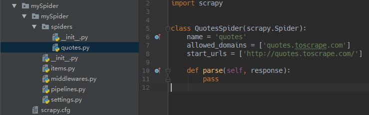
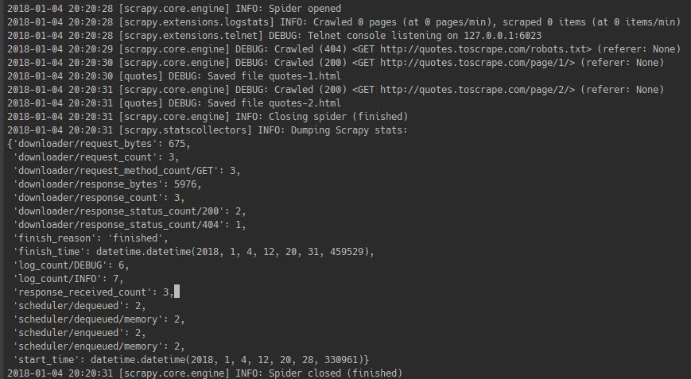
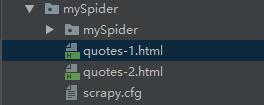

### Scrapy入门


>Scrapy是一个为了爬取网站数据，提取结构性数据而编写的应用框架。 可以应用在包括数据挖掘，信息处理或存储历史数据等一系列的程序中。

>其最初是为了 页面抓取 (更确切来说, 网络抓取 )所设计的， 也可以应用在获取API所返回的数据(例如 Amazon Associates Web Services ) 或者通用的网络爬虫。

安装参考：http://scrapy-chs.readthedocs.io/zh_CN/latest/intro/install.html

#### 新建项目
在开始爬取之前，必须创建一个新的Scrapy项目。进入自定义的项目目录中，运行下列命令：
```
scrapy startproject mySpider
```
`mySpider`为项目名称。命令运行完，可以看到一个mySpider文件夹。目录结构如下：


这些文件分别是:

- scrapy.cfg: 项目的配置文件
- mySpider/: 该项目的python模块。之后您将在此加入代码。
- mySpider/items.py: 项目中的item文件.
- mySpider/pipelines.py: 项目中的pipelines文件.
- mySpider/settings.py: 项目的设置文件.
- mySpider/spiders/: 放置spider代码的目录.

#### 定义Item
Item 是保存爬取到的数据的容器；其使用方法和python字典类似， 并且提供了额外保护机制来避免拼写错误导致的未定义字段错误。

类似在ORM中做的一样，您可以通过创建一个 scrapy.Item 类， 并且定义类型为 scrapy.Field 的类属性来定义一个Item。 (如果不了解ORM, 不用担心，您会发现这个步骤非常简单).

编辑items文件，代码如下：
```
class MyspiderItem(scrapy.Item):
    # define the fields for your item here like:
    # name = scrapy.Field()
    content = scrapy.Field()
    name = scrapy.Field()
    tags = scrapy.Field()


```

#### 编写第一个爬虫（Spider）
Spider是用户编写用于从单个网站(或者一些网站)爬取数据的类。

其包含了一个用于下载的初始URL，如何跟进网页中的链接以及如何分析页面中的内容， 提取生成 item 的方法。

为了创建一个Spider，您必须继承 scrapy.Spider 类， 且定义以下三个属性:

- name: 用于区别Spider。 该名字必须是唯一的，您不可以为不同的Spider设定相同的名字。
- start_urls: 包含了Spider在启动时进行爬取的url列表。 因此，第一个被获取到的页面将是其中之一。 后续的URL则从初始的URL获取到的数据中提取。
- parse() 是spider的一个方法。 被调用时，每个初始URL完成下载后生成的 Response 对象将会作为唯一的参数传递给该函数。 该方法负责解析返回的数据(response data)，提取数据(生成item)以及生成需要进一步处理的URL的 Request 对象。

进入之前创建的`mySpider`目录下，运行命令：
```
scrapy genspider quotes quotes.toscrape.com
```
Scrapy就自动帮你创建了一个Spider，打开如图：



将代码改写成
```
# -*- coding: utf-8 -*-
import scrapy


class QuotesSpider(scrapy.Spider):
    name = 'quotes'

    def start_requests(self):
        urls = [
            'http://quotes.toscrape.com/page/1/',
            'http://quotes.toscrape.com/page/2/',
        ]
        for url in urls:
            yield scrapy.Request(url=url, callback=self.parse)

    def parse(self, response):
        page = response.url.split("/")[-2]
        filename = 'quotes-%s.html' % page
        with open(filename, 'wb') as f:
            f.write(response.body)
        self.log('Saved file %s' % filename)
```

#### 爬取
进入项目的根目录，执行下列命令启动spider:
```
scrapy crawl quotes
```
启动了一个名为quotes的spider，将得到类似的输出



查看mySpider目录，



多了两个文件，正如代码所写！

以上。

